# The Omega Protocol EZgame


### **yoyokity制作**


绝欧米茄cacbot自定义js触发器，附带3D绘制

本科技讲究的就是一个给大脑按摩，目标是大脑瘫痪、小脑发育不全者都能过绝欧！

记得装cacbotself.dll，少了这个有个别机制会不报

spl安装方法:  https://github.com/gogofishman/TOP/blob/main/spl/spl安装说明.md

spl配套预设：https://github.com/gogofishman/TOP/blob/main/spl/splatoon.md


## 鸣谢

牙刷play : 不惜进去踩缝纫机, 完成了P1 部分

Errer : spl预设由E佬完成, 美化由我完成

莫灵喵 : 第一时间提供了过本回放dat文件

内部群全体群友 : 感谢兄弟们帮我完成测试找出各种bug ,并时刻监督我剁屌


## 匹配攻略：

- 统一MM+W https://docs.qq.com/doc/DWm1zbGxiWHltQnJk

- P5一运采用莫古力视频打法  https://www.bilibili.com/video/BV1Fb411d73r/?share_source=copy_web&vd_source=ea1df2345e8fcfd1f252bf7a10343c22

- 以下机制的头顶标记均可自定义修改

  1. P2一运  
  2. P5一运  
  3. P5二运 
  4. P5二运后半  
  5. P5三运三传四传

  


## 更新

(P6地火[非天箭] 显示有小概率act解析错,act的问题,不过肉眼看也很好看我就懒得修了)


**最新进度：全部完成**

2023.6.8：更新了国服spl预设，建议删光从头导入一遍

2023.6.7：删掉一些垃圾的官方库的tts

2023.5.9：P3小电视更新了日基脑死AI智能优化版，使得4个近战能更好输出，只有14%概率有一个T要去场边

2023.5.5：P6天箭第一次画圈比原先提早2秒 

2023.5.1：优化了设置部分

2023.3.21.21:47：全部完成，加入了P2.5手臂范围spl画图，P5每次死刑双T标禁止并提醒人群远离，P5三运前半小队鲶鱼精播报，修复P6宇宙天箭和P6地火，同时加入了P6狂暴输出检测

2023.3.13.19:10：前P5全部完成

2023.3.1.18:19 :	P5二运全部完成

2023.2.25.16:00：加入了P2二运自动标记双T，修复了P3小电视后和P5一运后标记不取消的问题

2023.2.21.17:51：P1一运完整写完，当前是beta版需要多测试稳定性

2023.2.21.00:22：更新到P5一运自动标记，修复P4换组bug

2023.2.17.23:51：修复小电视全部横排点名时会出现的bug


## 安装


1、打包下载

2、将里面的txt文件、js文件一起放在你cactbot的user目录下

```
呆萌ACT\Plugins\ACT.OverlayPlugin\cactbot\user\raidboss
```

这是呆萌act的目录，没raidboss这个文件夹就创建一个，注意两个文件一定要放一起

3、重启ACT或者重新加载cacbot

```
如果你要用git方便更新，在raidboss里随便创建一个子文件夹，比如叫"the_omega_protocol"，然后clone进去就行
```


## 配置

*打之前我们需要先设置一下你的使用习惯*

*用vsc或者记事本打开js文件*


关闭填false，开启填true 

#### 通用设置

```js
//是否开启指挥模式(目标标记，聊天框播报) (一个队必须只有一个人开,不然会顶掉)
const 指挥模式 = false;

//优先级 (也可以只设置你们队的8个职业,没有的职业不放进去也行),和cactbotSelf插件设置的优先级完全无关，本js独立
//H1 MT ST D1 D2 D3 D4 H2
const 优先级 = [
    '白魔',
    '占星',
    '战士',
    '黑骑',
    '枪刃',
    '骑士',
    '武士',
    '镰刀',
    '武僧',
    '龙骑',
    '忍者',
    '机工',
    '诗人',
    '舞者',
    '黑魔',
    '召唤',
    '赤魔',
    '贤者',
    '学者'
];

//P2一运索尼后击退，如果分摊点名同组，优先靠下面被点名的和他的连线对象换左右
//倒_是拉远线时右边组的情况
const 索尼 = {
    圆圈: '第一排',
    叉: '第二排',
    三角: '第三排',
    方块: '第四排',
    倒_圆圈: '第四排',
    倒_叉: '第三排',
    倒_三角: '第二排',
    倒_方块: '第一排',
};

//P3小电视打法，1为十字、2为日基（日基打法只标点）、3什么都不报什么都不标
const P3TV = 2;
```


#### 指挥设置

```js
//鲶鱼精聊天框全队播报
const PartyPostNamazu = true; //鲶鱼精聊天框全队播报总开关
const P1PostNamazu = true; //P1接线踩塔是否鲶鱼精聊天框全队播报
const P2PostNamazu = true; //P2狂暴倒计时是否鲶鱼精聊天框全队播报
const P3PostNamazu1 = true; //P3HW塔颜色播报
const P3PostNamazu = true; //P3小电视站位是否鲶鱼精聊天框全队播报
const P5PostNamazu = true; //P5是否鲶鱼精聊天框全队播报
const P6PostNamazu = true; //P6是否鲶鱼精聊天框全队播报

//标记
const useMark = true; //是否启用标记？（需确保鲶鱼精已启用）
const Mark = [1, 2, 3, 4, 5, 6]; //分P启用标记，不要开标记的P删掉（比如不要P3P5开那就 [1,2,4,6] ）
const onlyMeMark = true; //P1接线标记是否仅自己可见？
const onlyMeMarkP2 = false; //P2一运标记是否仅自己可见？
const onlyMeMarkP2_2 = false; //P2二运双T标记是否尽自己可见？
const onlyMeMarkP2_5 = false; //P2.5标记是否仅自己可见？
const onlyMeMarkP3 = false; //P3小电视点名标记是否仅自己可见？
const onlyMeMarkP5 = false; //P5点名标记是否仅自己可见？

//P2一运标记, 标记左边用攻击标记，右边锁链，从上到下1234 (因为没有锁链4，所以右4用方块代替)
const P2一运标记 = {
    左1: 'attack1',
    左2: 'attack2',
    左3: 'attack3',
    左4: 'attack4',
    右1: 'bind1',
    右2: 'bind2',
    右3: 'bind3',
    右4: 'square',
};
const P5一运标记 = {
    外侧_上: 'attack1',
    外侧_下: 'attack2',
    内侧_上: 'stop1',
    内侧_下: 'stop2',
};
const P5二运标记 = {
    上: 'bind1',
    下: 'attack4',
    左: 'attack2',
    右: 'bind3',
    左上: 'attack1',
    右上: 'bind2',
    左下: 'attack3',
    右下: 'stop1'
};
const P5二运后半标记 = {
    远传递左: 'attack1',
    手引导左: 'attack2',
    手引导右: 'attack3',
    远传递右: 'attack4',
    世界近: 'bind1',
    世界远: 'stop1',
    近传递左: 'bind2',
    近传递右: 'bind3',
};
const P5三运三传标记 = {   //四传也一样，小电视等于拉线
    世界近: 'bind1',
    世界远: 'attack1',
    小电视左: 'stop1',
    小电视右: 'stop2',
    远传递左: 'attack2',
    远传递右: 'attack3',
    近传递上: 'bind2',
    近传递下: 'bind3',
};
```


## 说明

以下是本科技会怎么报，以及需要使用哪些打法等

（不需要特殊说明的tts就不在下面拿出来强调了）


### P1

- **踩塔**：直接告诉你踩哪个塔（比如”踩左塔“）

- **拉线**：不会告诉你拉到哪里去，但是会告诉你优先级大还是小
- **拉线标记**：会给当前拉线的两人标记锁链1、2，优先级大的标1，方便看

- **鲶鱼精播报**：（这个一般拿来复盘更多一点）

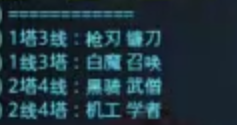

- **全能之主**：告诉你去上半场还是下半场


------


### P2

- **索尼 + 一运击退**：

​		索尼一出来就会按照分组优先级给你标记好

​		左边组从上到下：攻击1234

​		右边组从上到下：锁链123方块 （毕竟没有锁链4捏）

​		（不需要思考是否拉长线要的情况，也不需要考虑点名分组交不交换，告诉你的是你最终要去的位置，科技		都算好了，解放大脑）

​		一运参考图(tts图我随便找的一次记录,图中是报远离):

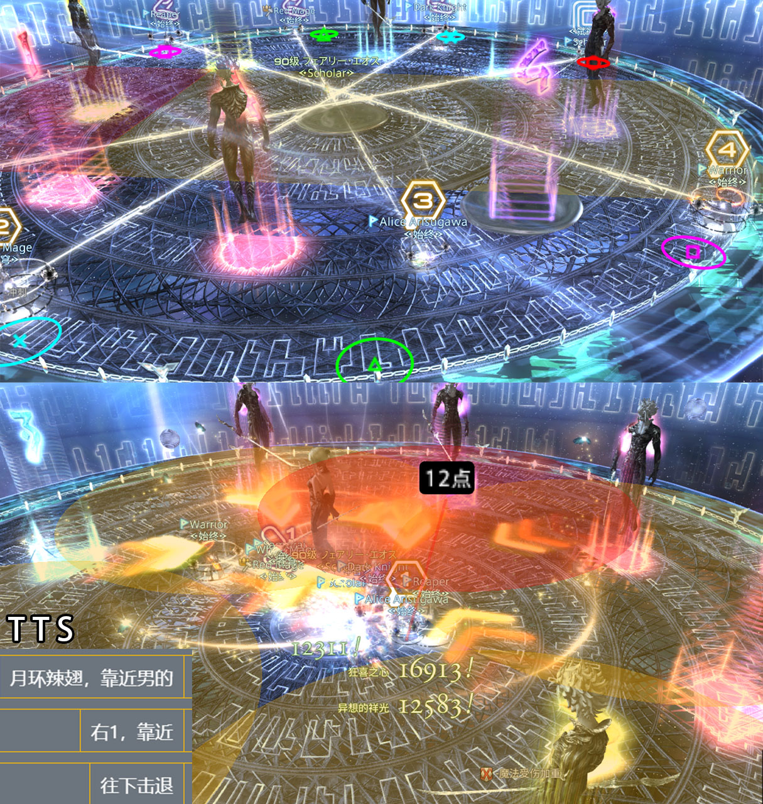

- **二运**：没啥好说的，用所有人站一起吃陨石的打法，无脑的一比
- **狂暴倒计时**：(最新版中取消了se.1的声音)

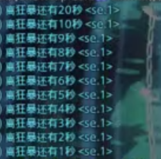


------


### P3

- **2.5运标记**：会自动根据优先级给每个人标上标记，看自己标记根据图中站位就行（当然TTS也会报去哪个位置）同时会画出手臂AOE的范围和自身分摊分散的范围

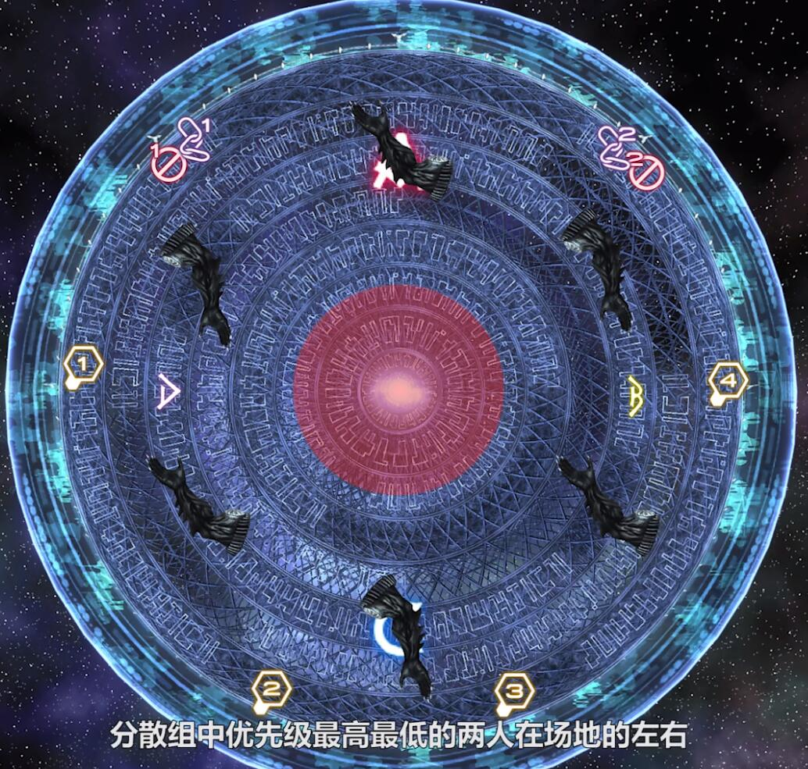

- **HW**：先报塔颜色，然后每一轮卡着时间告诉你怎么走

​		例子：（第一次拉蓝色线的tts）(图片只是spl参考,和右边tts是对不上的,不是同一把)

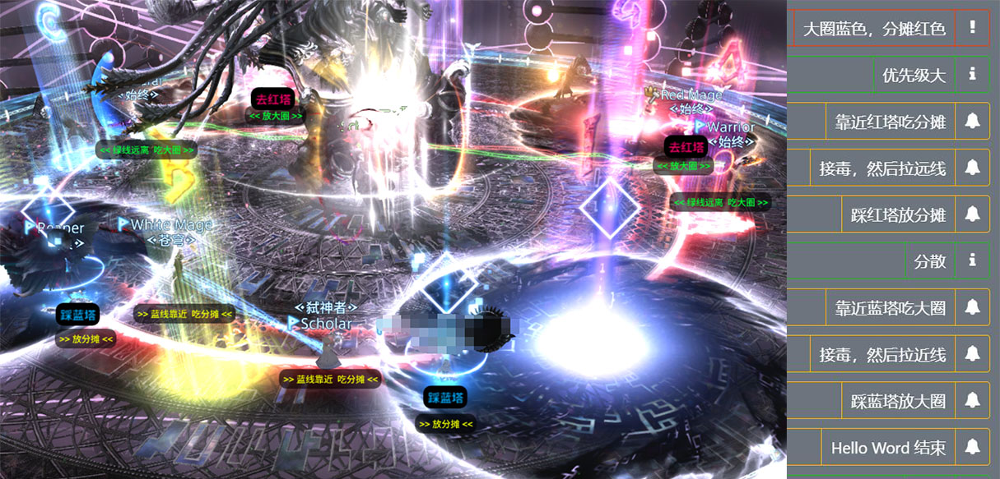

- **电视屏幕**：

**日基脑死（智能优化版）:**

默认日基脑死,配合spl会画地上的位置和放小电视的方向。

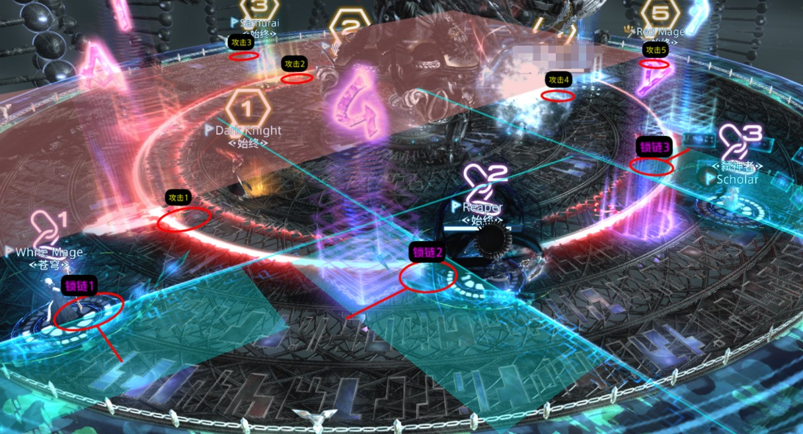

- 本科技在原版日基脑死的基础上，进一步优化，智能安排标记，使4个近战尽可能打的到BOSS，不去场边。
- 下图为所有位置被标记的所有可能性，MTSTD1D2D3D4H1H2
- **4个近战有人打不到boss的概率为14.2%**：1.7%的概率MT点名锁链1，5.3%的概率ST点名锁链1，7.1%概率ST点名攻击3。
- **D1D2永远能打到boss**。
- D1D2尽可能打侧身位或背身位，D1有1.7%概率去BOSS面前，D2有8.9%概率去BOSS面前。
- 有近战黑魔的情况下，所有近战所有情况均能打到boss。

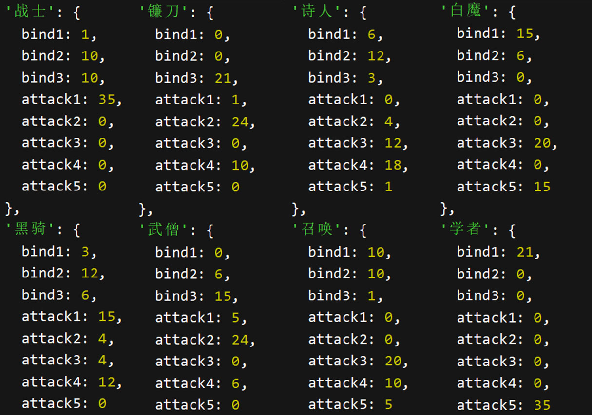


**科技十字法:**

也可以使用十字打法(更脑死,所有近战都不会掉输出)

听我说，别用什么XX打法XX打法，都是辣鸡，都给我用天下无敌的十字法，配合我这个科技，你不需要搞懂机制原理，不用看别的攻略，直接做到动一下脑子算我输

（注：MM+W攻略里要求一开始站两排，最初文档是DPS在上TH在下，现在文档倒过来了，本科技用的逻辑是最初的。但是你打的时候完全不影响就是，甚至不需要站两排看，随便站，TTS报了去对应位置就行）

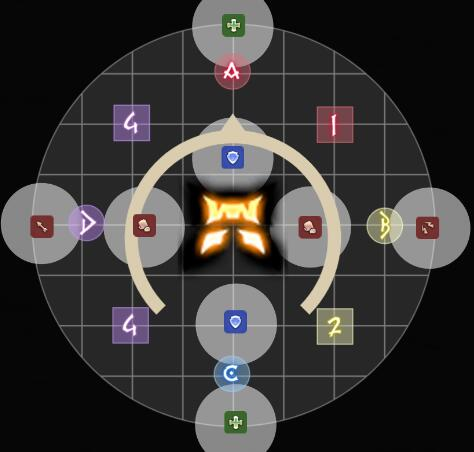

​		

1. 八个点位如图所示八个白圈（每个人只可能站两个点）

   H1 D3：横排第1或竖排第1

   D1 MT：横排第2或竖排第2

   D2 ST：横排第3或竖排第3

   D4 H2：横排第4或竖排第4

2. **读条出来，科技告诉去哪个点，然后根据科技报的，面朝或者背对boss**，

3. **被点名者最后往tts报的方向（以角色面向为前方）走一步即可**

4. **（注意！中间四个人要进BOSS目标圈里面，不然会钢铁炸到后面）**

   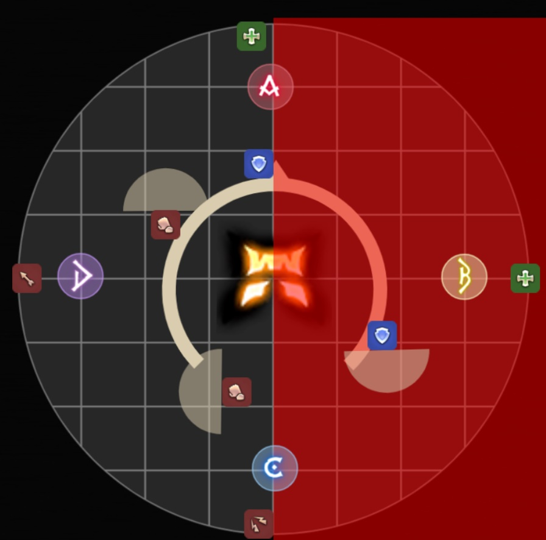

   

   

   图片1为D2被点名小电视，tts会这么报
   
   图片2为鲶鱼精小队列表提示走位（最新版已经优化了空格缩进，让中间完全居中）
   

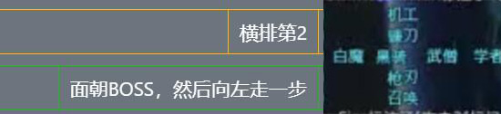

**开荒tips**：只要你被点名，不管面对还是背对boss，读条结束前请务必停手调整面向（你被点了面对boss，不停手猛打最后角度依然会歪，因为你放小电视的不是在正点上的）


------


### P4

(如果你优先级设置有问题,这里的换位提示也会有问题哦)

- 分摊点名：本科技使用打法为MM+W文档打法，即如图中所示站位，点名同一边两个的时候最下面的近战去补位

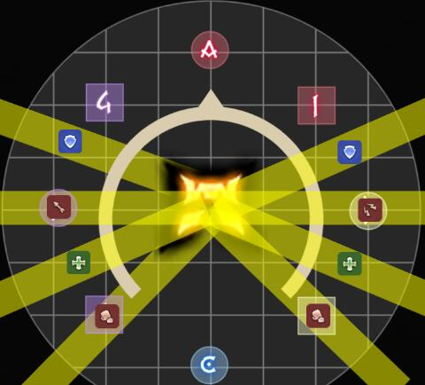


------


### P5

每次死刑的时候，会禁止1禁止2标记双T


#### 一运（莫古力视频打法）

- **标记**：如图所示，连线一出来就会标，根据自己头上的标记去相应位置（交不交插都不影响科技，引导哪个转转手科技不会报，自己去自己该去的，引导方向画图会画）

  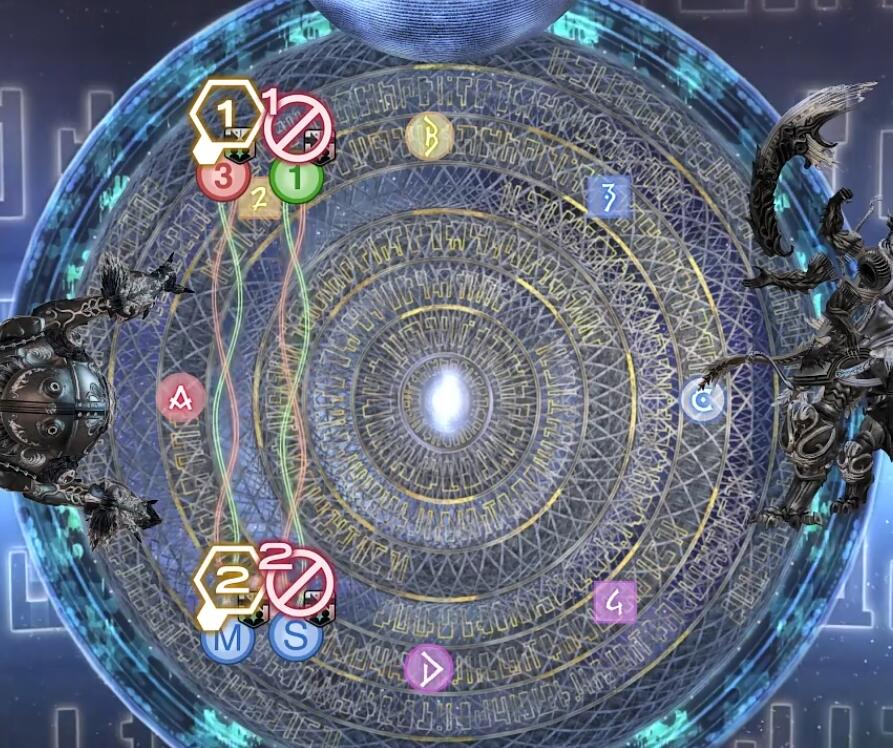

- **流程例子**：其中蓝线近组的tts例子（科技会自动抓取小拳拳出来时每个人的位置判断谁是蓝线远组谁是蓝线近组）

  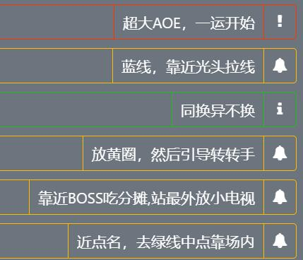

- **画图**：

1. 转转手引导位置（左还是右）

2. BOSS小电视半场

3. 左右刀范围

4. 你好世界近或远的钢铁aoe范围

5. 最终所有人的站位提示

   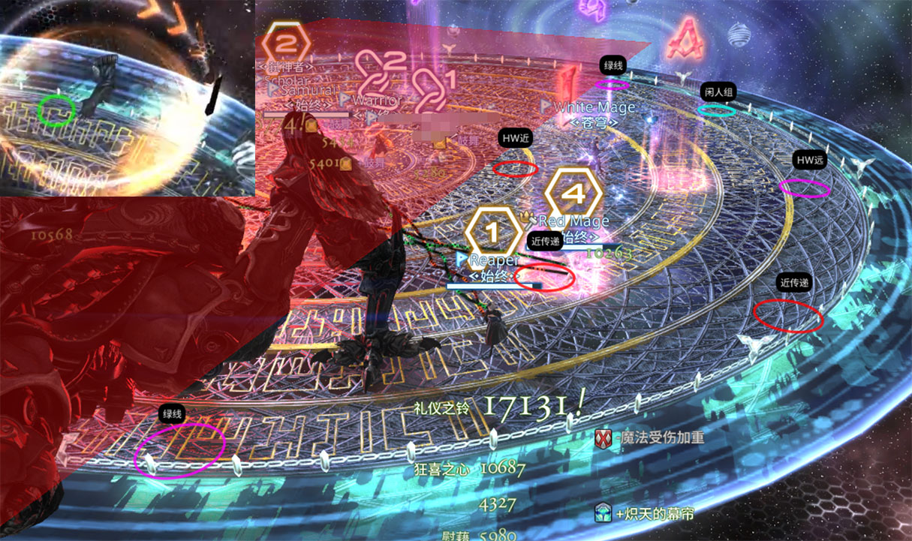


#### 二运

**调整正北方向**：整个二运以男人(后面变女人)为12点，spl会画出来  （哪怕你们队不是这样的，你自己这样看就行，没区别，脑子灵光点）

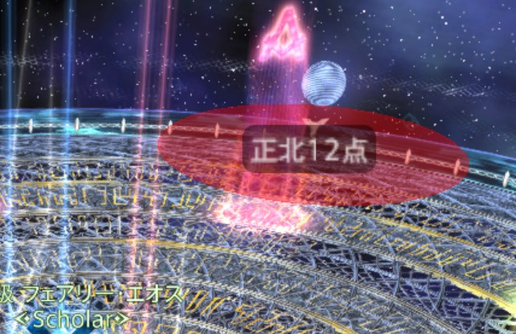


**拉线**：因为有科技全自动标点，所以可以忽略攻略上的排排站看点名

当红色点名出来后，科技会给每个人标上标点，去自己的位置引导就行。

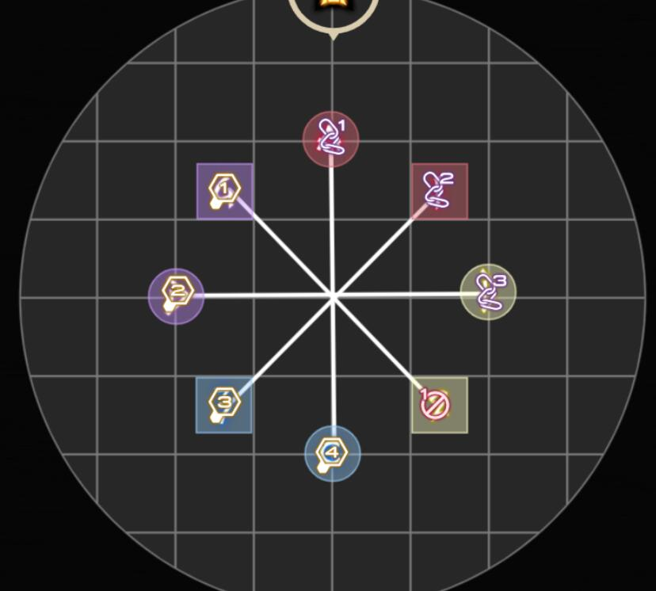

画图会标示八个点

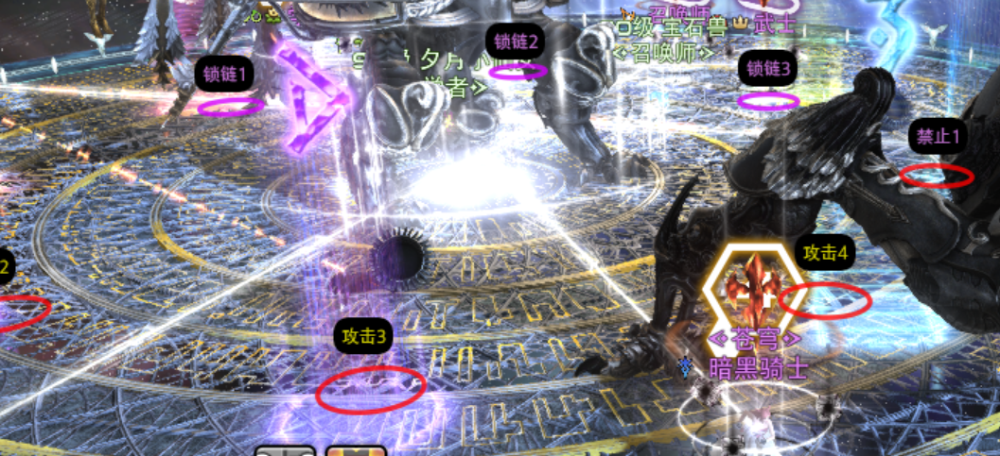


 

**踩塔**：踩塔逻辑和MM+W文档一样

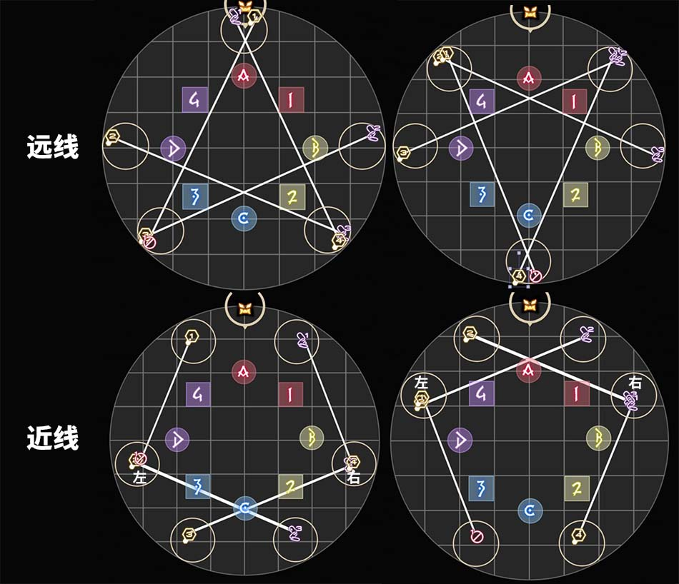

科技会告诉你去哪个塔，以女人为12点去左塔、左上塔、下塔等等，同时spl连线你要去的塔!

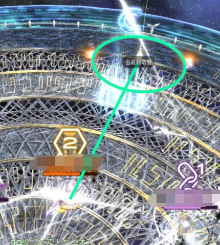

**后半**：tts会这么报

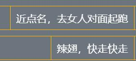

自动标点（当然也可以自己改）

- 攻击标点如图所示 
- 世界远点名：禁止1
- 世界近点名：锁链1
- 近传递左：锁链2
- 近传递右：锁链3

同时会自动画出你要去的点连线


直线会画出起跑点


#### 三运前半

1. **前半AOE范围spl会绘制 （这个就不拿出来说明了，用红色绘制AOE范围）**
2. **同时tts会报安全点**
3. **最后spl也会把安全点画出来**


**tts的报法（同时会发到小队列表）**：先A远，后B近  （举个例子）

注：在第一对男女出来的时候，此时第二对男女和BOSS扇形还没出来，tts会先告诉你两个点（“找AB点”），你靠近这两个点中间就行（方便走，以免来不及反应）。BOSS扇形出来的同时，tts告诉你最终的安全点


**spl的安全点画法**：先1后2


#### 三运后半

1. **两轮传递会自动标记**
2. **spl会画出所有点位**


**三传和四传 的头上标记走法：**


### P6

**射手天箭**：会画出每一次的安全点，蓝绿色圈为斜点走法，红色圈为正点走法（第一次射手天箭只画斜点）


**地火**：除了会TTS报方向和顺逆外，spl也会画出来安全点


**陨石**：

鲶鱼精小队会发人群去A还是C，

同时TTS会报每个人去的位置，

被点名陨石的人会根据当前相对左右位置告诉你去“左D”还是“右B”


**LB**：会提醒啥时候开啥LB


**狂暴**：会检测血量，告诉你这把能不能过
