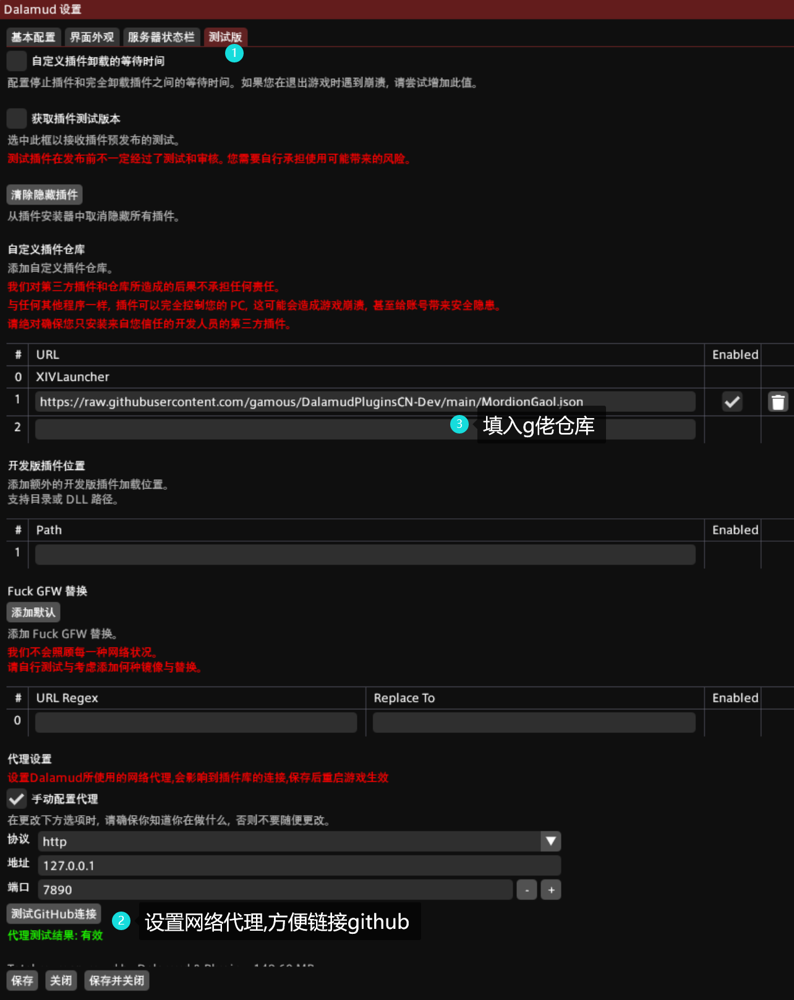

# 卫月安装

国服: https://aonyx.ffxiv.wang/

国际服: https://goatcorp.github.io/


- 安装时勾选"启用Dalamud"
- 安装后的是卫月启动器,你可以直接用这个一键启动游戏,同时自动注入卫月插件.(就可以绕过傻逼的游戏本体启动器了)
- 国服卫月启动器可能要你打开手机叨鱼确认下
- 第一次启用游戏发现分辨率不正常时,进卫月启动器的设置里,把"修正DPI"来回试几次就好了(修正和不修正反复多试几次)
- 国际服卫月启动后中文显示不正常的话,给游戏打汉化包并勾选设置中的"使用AXIS字体作为默认字体",不想打汉化包就用英文


# 卫月使用指令

游戏聊天框输入

```
/xlplugins
```

> 觉得麻烦可以写个宏放在游戏技能栏里


或者游戏中摁esc


# spl安装

1.在设置中填入G佬的仓库,不然的话国服是默认不能用spl的

```
https://raw.githubusercontent.com/gamous/DalamudPluginsCN-Dev/main/MordionGaol.json
```

如果是国际服,填入原始库

```
https://raw.githubusercontent.com/NightmareXIV/MyDalamudPlugins/main/pluginmaster.json
```




2.在插件安装器中安装splatoon


3.设置spl (不一模一样出了问题就是自己纯傻逼)


# spl预设导入

1.勾选批量导入


2.打开spl配套预设：https://github.com/gogofishman/TOP/blob/main/spl/splatoon.md 

3.依次点击每个预设的复制按钮


4.全部导入后取消"批量导入"的勾选

5.导入完成


